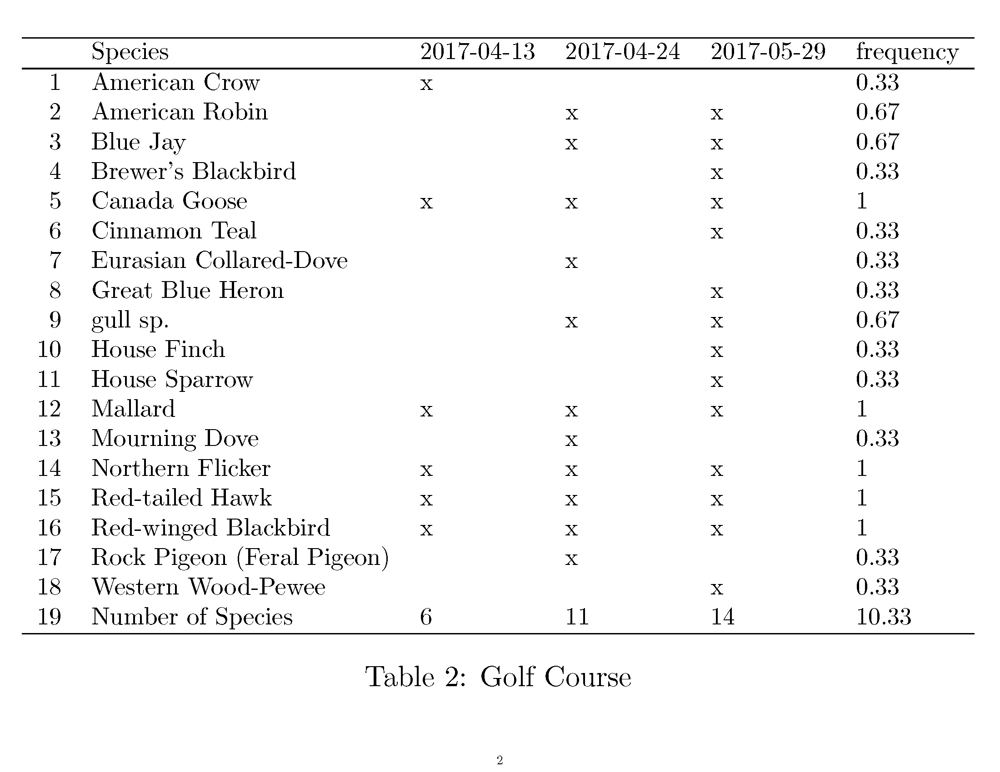

# eBird-reporting

This provides the initial framework for generating various reports based on time, location, or species using your downloadable eBird data.

`analyze.R` is used to generate different types of reports, and `generateReport.Rnw` is used to format and print the tables.

So far, this has only served for personal usage and has not been optimized for use on a broader scale, but any issues can be addressed upon request, as can feature additions.

Some sample reports can be seen below, and more examples are commented out in `generateReport.Rnw`.

More detailed documentation to come.

## BackyardMonth

Get a detailed account of what birds were seen in your backyard during a specific month, including what was spotted each day, each bird's frequency, and species counts.

```
backyard_may = BackyardMonth("May")
printReport(backyard_may, "May 2017 - Backyard", "0.85")
```


## createLocationSummary
Visualize what species you have seen, and when, at a specific location.

```
golf_course = createLocationSummary("Golf Course")
printReport(golf_course, "Golf Course", "0.85")
```


## LifeList
Visualize your entire life list, or your life list for a specific location.

```
life_list = LifeList("Backyard")
printReport(life_list, "Backyard Lifelist", "0.85")
```


## WhereDidISee
Visualize the locations you have seen a species.

```
heron = WhereDidISee("Great Blue Heron")
printReport(heron, "Great Blue Heron Locations", "1")
```

